# Tom's Schedule

Time management Android app made with Java. You can add your everyday activities and track the time you spend on them.
The app uses Firebase and SQLite database.

## Registration and login

To use the app you must register and login.

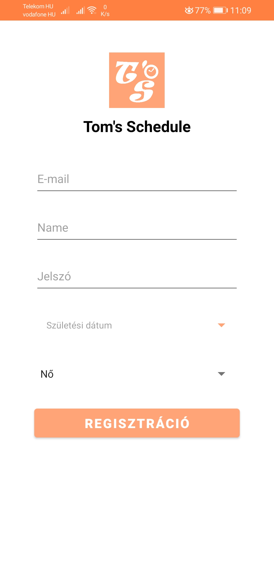
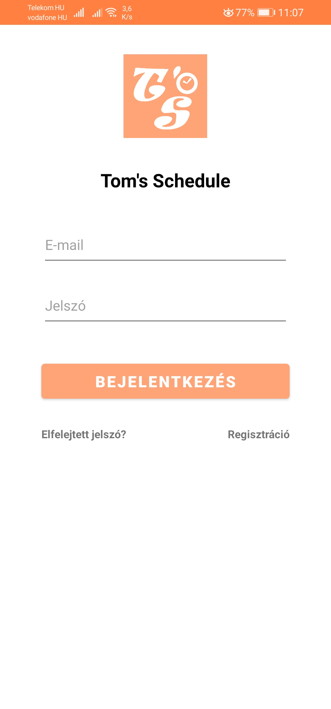

## Home page

On the home page the user is able to see their activities. They can add new activities and watch their details.
They may add different settings, and track the time spent on these activities.

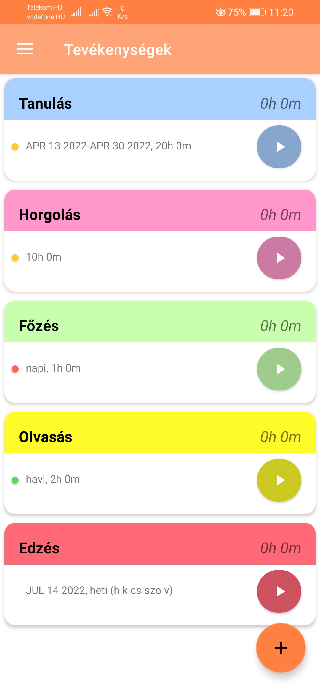
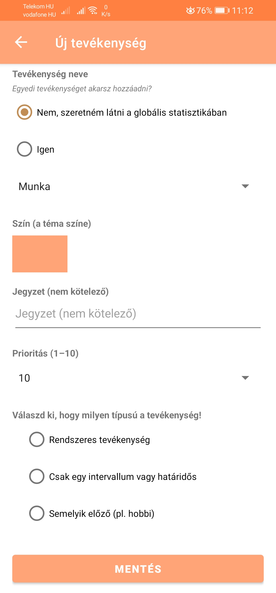
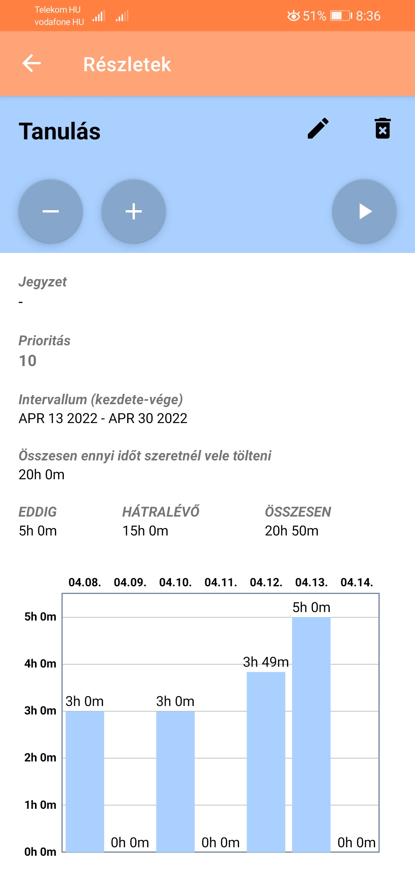

## Timer

The user is able to start a timer on a specific activity.

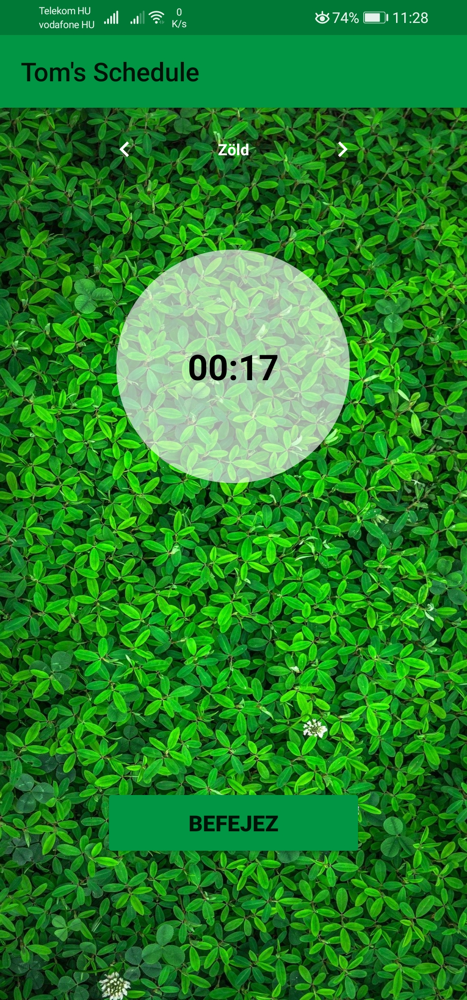
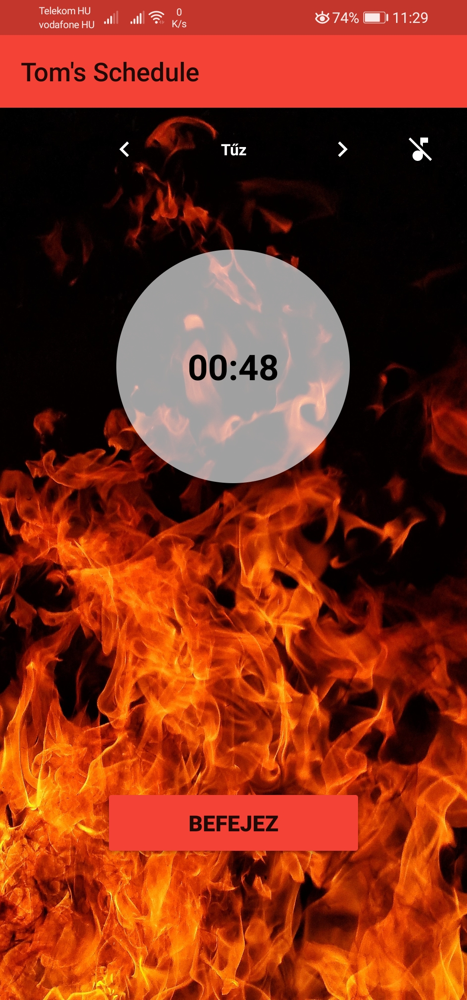
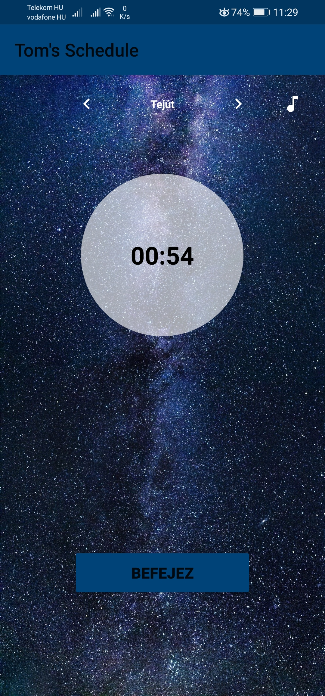

## Statistics

Seeing how much time you spend on each activity is helpful to make the necessary changes in your schedule. This is the reason why there is an opportunity to see different statistics that made from your activities.
The charts were made with [MPAndroidChart](https://github.com/PhilJay/MPAndroidChart)!

#### Personal statistics

Statistics made from your own data.

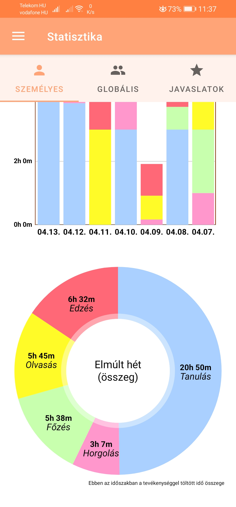
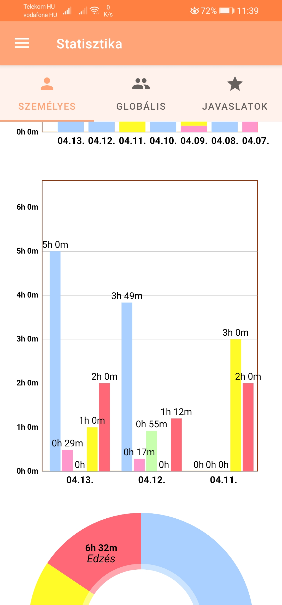

#### Global statistics

Statistics made from all of the users' statistics provided by Firebase. The data cannot be connected to users or devices.

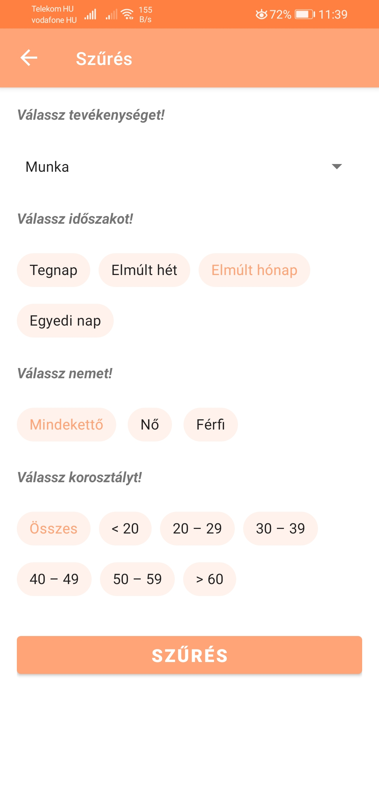
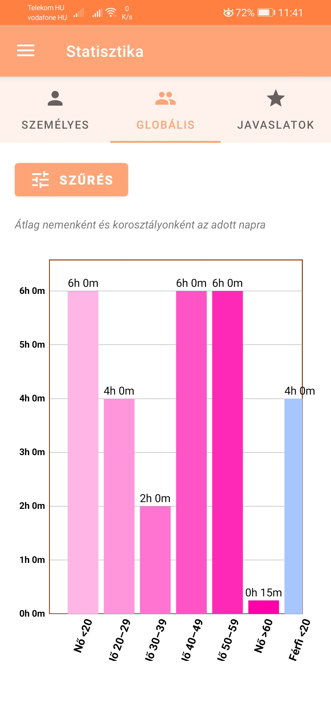
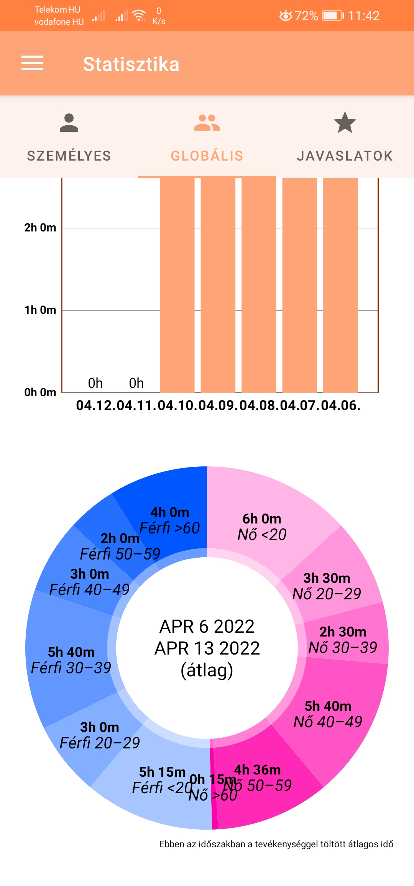

## Backup

You are able to create and restore backups.

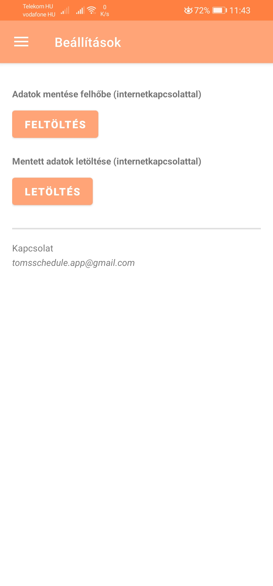

## Other

I made this app as my dissertation topic.
